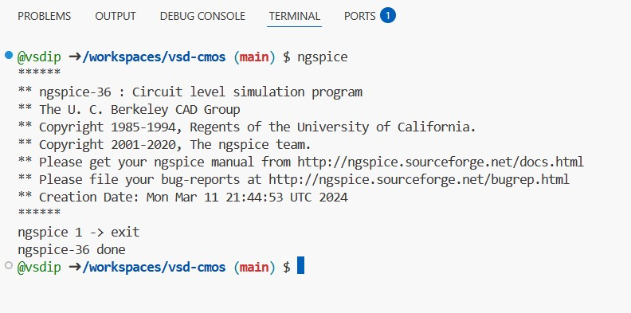
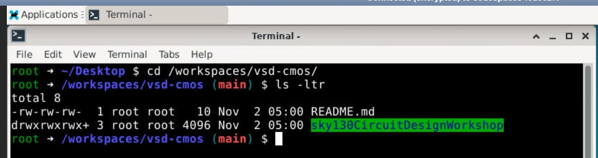
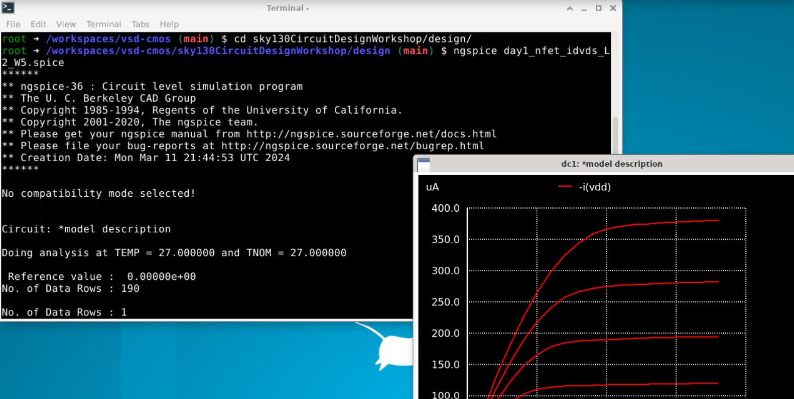

# VSD-CMOS — CMOS Circuit Design on Cloud (with GUI/VNC)

Run **Sky130 CMOS design labs** on GitHub Codespaces — entirely in your browser, with **ngspice**, **noVNC GUI desktop**, and ready-to-use **SPICE simulation decks**.
No local setup required — everything runs inside your browser tab.

---

## 1. Launch the Codespace

From your GitHub repository page:

1. Click on **Code → Codespaces → Create codespace on main**
   

GitHub will automatically create a cloud-based Ubuntu environment for you.
All setup and dependencies are pre-configured.

---

## 2. Start ngspice and Verify Installation

Once inside Codespace, open a **terminal** and type:

```bash
ngspice
exit
```

You’ll see the ngspice version banner confirming installation.

If ngspice exits successfully, your setup is ready.


---

## 3. Enable GUI / noVNC Desktop

This Codespace comes with a full **graphical desktop environment** accessible through **noVNC**.
Check the **PORTS** tab for a forwarded VNC link, typically on port `6080`.


Click the forwarded address — it opens a Linux desktop in your browser:


Use this environment to visualize ngspice plots and waveforms interactively.

---

## 4. Navigate to Workshop Files

Switch to your workspace folder:


```bash
cd /workspaces/vsd-cmos
ls -ltr
```

You’ll see the folder `sky130CircuitDesignWorkshop/` that contains design files.


---

## 5. Run SPICE Simulations (with Plot Output)

Move into the design folder and execute any `.spice` file:

```bash
cd /workspaces/vsd-cmos/sky130CircuitDesignWorkshop/design
ngspice day1_nfet_idvds_L2_W5.spice
```

This opens an ngspice waveform window in the GUI (via noVNC).


You’ll see drain current vs. voltage characteristics plotted interactively — just as in a local desktop.

---

## 6. Folder Structure

```
vsd-cmos/
├── README.md
├── images/                         # screenshots for this documentation
└── sky130CircuitDesignWorkshop/
    └── design/                     # SPICE decks, model files, and plots
```

---

## 7. Troubleshooting

* **Blank VNC Screen:** Wait a few seconds for the GUI to initialize or refresh the browser tab.
* **No ngspice plots:** Ensure you are running ngspice inside the VNC terminal (not VS Code terminal).
* **Port not visible:** Reopen the **Ports** tab → click **Add Port** → set to `6080` → make it public or private as needed.

---

## Credits

Developed as part of the **VSD CMOS Circuit Design Workshop** using **Sky130 PDK** and **ngspice-36**.
Codespace provisioning and environment are maintained by **VSD (VLSI System Design)**.

---

**Now, simulate your first CMOS circuit — completely on the cloud.**
Learn. Design. Run. Visualize.
